# CoALA Explainer — What It Is, Where It Lives in WARNERCO

**Audience:** developers and students who want to understand the framework behind WARNERCO's memory architecture *and* immediately know which file implements each piece.

**Reading time:** ~15 minutes.

**Reading order:** read this **first**, then run the live demo at [`coala-memory-walkthrough.md`](coala-memory-walkthrough.md). Both modes work, but the explainer assumes you haven't done the demo yet.

---

## What is CoALA?

**CoALA = Cognitive Architectures for Language Agents.** Sumers, Yao, Narasimhan, and Griffiths, *Transactions on Machine Learning Research*, February 2024 ([arXiv:2309.02427](https://arxiv.org/abs/2309.02427)).

The paper takes 50 years of cognitive-science research on human memory and proposes that language agents should organize their memory the same way humans do — **four distinct tiers**, each with different read/write/decay rules. Not one big bucket called "memory."

The four tiers answer four different questions:

| Tier | The question | Human analogue |
|---|---|---|
| **Working** | "What am I thinking about *right now*?" | Inner monologue while reading this sentence |
| **Episodic** | "What happened *to me*?" | "I remember asking that 5 minutes ago" |
| **Semantic** | "What do I *know* about the world?" | "Hydraulics can overheat" — a fact, untethered from when you learned it |
| **Procedural** | "What do I *know how to do*?" | Riding a bike. The skill itself, not the memory of using it. |

---

## Why four tiers, not one bucket?

Most pre-2024 "agent memory" systems were one vector store. Everything went in. Vector search was the only way out. That collapses four very different problems into one mediocre solution. CoALA's pitch is that each tier needs a different backend because they have **different physics**:

| Failure mode of "one vector store" | What CoALA fixes |
|---|---|
| A casual aside from 30s ago competes for retrieval ranking with a durable engineering fact from 6 months ago | Working memory and semantic memory live in **different stores** with different decay |
| No notion of "this happened *to me at this time*" — can't ask "what did we discuss yesterday?" | Episodic memory has explicit timestamps and a recency-weighted scoring formula |
| Procedural skills get embedded as text and randomly retrieved — agent might "discover" a workflow it shouldn't run | Procedural memory is **user-invoked**, versioned, and lives in source control, not in a searchable index |
| One write rule (embed + index) for everything — slow, expensive, one-size-fits-all | Each tier has its own write path; cheap stuff stays cheap |

Concrete WARNERCO example: when you ask "why is WRN-00006's thermal subsystem failing?", the agent should pull (a) **what you just wrote in your scratchpad** (working), (b) **what you asked 2 turns ago** (episodic), (c) **the schematic itself** (semantic), and (d) **the diagnostic prompt template** (procedural). One bucket can't do that without leaking context across categories.

---

## Tier 1: Working Memory

### Definition

The agent's scratchpad **for the current session**. Observations, inferences, and notes that should inform the next reasoning step but probably don't matter next week. Volatile in spirit — even though we persist it to SQLite for class demos, the contract is "session-scoped."

**Properties:** cheap to write, cheap to read, small in volume, session-scoped, no relevance scoring (just recency-ordered injection).

### WARNERCO implementation

| What | Where |
|---|---|
| Adapter | [`app/adapters/scratchpad_store.py`](../../src/warnerco/backend/app/adapters/scratchpad_store.py) |
| Storage | `data/scratchpad/notes.db` (SQLite) |
| Models | [`app/models/scratchpad.py`](../../src/warnerco/backend/app/models/scratchpad.py) |
| LangGraph node | `inject_scratchpad` — see [`app/langgraph/flow.py`](../../src/warnerco/backend/app/langgraph/flow.py) line 243 |
| MCP tools | `warn_scratchpad_write`, `warn_scratchpad_read`, `warn_scratchpad_clear`, `warn_scratchpad_stats` |

**Predicate vocabulary** (cognitive operations on entries):
`observed` · `inferred` · `relevant_to` · `summarized_as` · `contradicts` · `supersedes` · `depends_on`

**Special features in WARNERCO** (beyond raw CoALA):
- **LLM minimization on write** — content gets compressed by an LLM call before storage; the original is kept side-by-side.
- **LLM enrichment on write** — context-expansion runs once at write time, cached in the row, so reads are pure SQL (no LLM cost).
- **Token budget for injection** — the LangGraph node respects a configurable budget (default 1500 tokens) so working memory can't dominate the prompt.

### Try it now

```text
Tools → warn_scratchpad_write
  subject:    WRN-00006
  predicate:  observed
  object_:    thermal_system
  content:    Operator reports thermal trips during heavy hydraulic load
  minimize:   true
  enrich:     true
```

Then `warn_scratchpad_stats` shows `tokens_saved` and `savings_percentage` — the LLM minimization in action.

---

## Tier 2: Episodic Memory

### Definition

**Specific past events with timestamps.** What happened, when, how important it was. The agent's autobiographical record. Append-only — you don't edit yesterday's events; they just get less relevant as time passes.

**Properties:** append-only, time-indexed, importance-scored at write, recall is the **Park et al. recency × importance × relevance formula**.

### The Park et al. formula

From *Generative Agents* (Park et al., UIST 2023), implemented verbatim in `EpisodicStore.recall()`:

```
total = α_recency · 0.5^(hours_since / half_life_hours)
      + α_importance · stored_importance
      + α_relevance · cosine(query_terms, summary_terms)
```

WARNERCO defaults (override via `EPISODIC_*` env vars):

| Knob | Default | What it does |
|---|---|---|
| `EPISODIC_WEIGHT_RECENCY` | 0.4 | How much the agent values "I remembered this recently" |
| `EPISODIC_WEIGHT_IMPORTANCE` | 0.3 | How much the agent values "this seemed important when it happened" |
| `EPISODIC_WEIGHT_RELEVANCE` | 0.3 | How much the agent values "this matches what I'm asked about now" |
| `EPISODIC_RECENCY_HALF_LIFE_HOURS` | 24.0 | How fast recency decays — 24h means a 1-day-old event scores half a brand-new one |

Crucially, `warn_episodic_recall` returns the **per-event score breakdown** in the response, so you can see *why* each memory surfaced. That's the slide-worthy moment of the demo.

### WARNERCO implementation

| What | Where |
|---|---|
| Adapter | [`app/adapters/episodic_store.py`](../../src/warnerco/backend/app/adapters/episodic_store.py) |
| Storage | `data/episodic/events.db` (SQLite, single 8-column table) |
| Models | [`app/models/episodic.py`](../../src/warnerco/backend/app/models/episodic.py) |
| LangGraph nodes | `recall_episodes` (gated to ANALYTICS/DIAGNOSTIC, line 276) + `log_episode` (always, line 547) in [`app/langgraph/flow.py`](../../src/warnerco/backend/app/langgraph/flow.py) |
| MCP tools | `warn_episodic_log`, `warn_episodic_recall`, `warn_episodic_recent`, `warn_episodic_stats` |

**Event kinds:** `USER_TURN` · `AGENT_RESPONSE` · `TOOL_CALL` · `OBSERVATION`

**Pedagogical simplifications, flagged in code:**
- **Bag-of-words cosine** for relevance, not embeddings. Three lines of readable code, zero embedding spend per recall. Swap to embeddings in the `_relevance()` helper — comment in `episodic_store.py` shows where.
- **Importance heuristic** in `log_episode`: errors → 0.8, diagnostic → 0.6, analytics → 0.4, search/lookup → 0.3. Real agents would learn this; we keep it as a transparent rule a student can read in two lines.
- **Episodic recall is gated** to ANALYTICS and DIAGNOSTIC intents only. Pure ID lookups don't need session history; ungated recall just pollutes the context.

### Try it now

After running 2–3 diagnostic queries with the same `session_id`:

```text
Tools → warn_episodic_recall
  query: thermal hydraulic problems
  k:     5
```

The `scores` array in the response shows `{recency, importance, relevance, total}` for each event. Point to it. That's the formula made visible.

---

## Tier 3: Semantic Memory

### Definition

**Durable, generalizable knowledge.** Facts. The kind of thing you wouldn't say "I remember when I learned that" about — you just know it. Expensive to write (embeddings cost money), and contradictions need conflict resolution.

**Properties:** durable, persistent across sessions, expensive to write, scales to thousands of records.

### WARNERCO implementation

Three swappable backends behind a single interface, plus a knowledge graph alongside:

| Backend | When to use | File |
|---|---|---|
| JSON | Prototyping, fastest startup, keyword-only fallback | [`app/adapters/json_store.py`](../../src/warnerco/backend/app/adapters/json_store.py) |
| Chroma | Local dev, true vector search, ~2-5s startup | [`app/adapters/chroma_store.py`](../../src/warnerco/backend/app/adapters/chroma_store.py) |
| Azure AI Search | Enterprise / production scale | [`app/adapters/azure_search_store.py`](../../src/warnerco/backend/app/adapters/azure_search_store.py) |

Switch via `MEMORY_BACKEND={json,chroma,azure_search}` in `.env`. Same `MemoryStore` interface, three implementations.

| What | Where |
|---|---|
| Source of truth | `data/schematics/schematics.json` — 25 robot schematics |
| Vector store cache | `data/chroma/` (gitignored — regenerate with `ChromaMemoryStore().index_all()`) |
| Knowledge graph | [`app/adapters/graph_store.py`](../../src/warnerco/backend/app/adapters/graph_store.py) — SQLite + NetworkX, 117 entities and 221 relationships |
| LangGraph node | `retrieve` — see [`app/langgraph/flow.py`](../../src/warnerco/backend/app/langgraph/flow.py) line 312 |
| MCP tools | `warn_semantic_search`, `warn_get_robot`, `warn_list_robots`, `warn_index_schematic`, plus 6 more (CRUD + comparison + explanation) |
| Graph tools | `warn_graph_neighbors`, `warn_graph_path`, `warn_graph_stats`, `warn_add_relationship` |

Note that the **knowledge graph** is *also* semantic memory in CoALA terms — same tier, different shape. Vector search finds *similar* things; graph queries find *connected* things. Use both for comprehensive retrieval. The 9-node LangGraph pipeline runs `query_graph` *before* `retrieve` so graph context primes vector search.

### Try it now

```text
Tools → warn_semantic_search
  query:      thermal sensors for cold environments
  session_id: class-demo
  top_k:      5
```

---

## Tier 4: Procedural Memory

### Definition

**Versioned skills/workflows the agent can perform.** System prompts, tool definitions, slash-command playbooks. The instructions for *how to do something*, not the memory of having done it.

**Properties:** user-invoked (this is the critical CoALA design choice), versioned, lives in source control with CI publishing changes.

### Why procedural is the riskiest tier

CoALA is explicit about this — direct quote from the paper:

> "Learning new actions by writing to procedural memory is significantly riskier than writing to episodic or semantic memory, as it can easily introduce bugs or allow an agent to subvert its designers' intentions."

This is why MCP Prompts are surfaced as **slash commands invoked by the user**, not auto-pulled by the model. The agent doesn't get to discover its own skills mid-flight.

### WARNERCO implementation

| What | Where |
|---|---|
| Source | `@mcp.prompt()` decorators in [`app/mcp_tools.py`](../../src/warnerco/backend/app/mcp_tools.py) |
| Catalog helper | [`app/adapters/coala_overview.py`](../../src/warnerco/backend/app/adapters/coala_overview.py) (`PROCEDURAL_PROMPTS` constant) |
| Catalog resource | `memory://procedural-catalog` |
| Versioning | Each prompt's docstring is tagged `[CoALA: procedural memory — version 1.0.0]` |

**The five registered prompts:**

| Prompt | What it does |
|---|---|
| `diagnostic_prompt` | Structured diagnostic analysis for one schematic |
| `comparison_prompt` | Side-by-side comparison of two schematics |
| `search_strategy_prompt` | Coaching prompt — how to search the catalog effectively |
| `maintenance_report_prompt` | Maintenance-report template for a robot model |
| `schematic_review_prompt` | Technical-review checklist for a schematic |

### Try it now

```text
Resources → memory://procedural-catalog
```

Returns a JSON list of all five prompts with their versions and descriptions. In Claude Desktop or VS Code Copilot Chat, the same prompts appear as **slash commands** in the UI — `/diagnostic_prompt WRN-00006`, etc.

---

## The Sleep Cycle: Consolidation

Working and episodic memory are short-term. Semantic is long-term. **Consolidation** is the bridge — the moment an agent decides "this short-term observation is durable enough to commit to long-term knowledge." Same idea as your brain consolidating short-term memory into long-term during sleep.

### WARNERCO implementation

| What | Where |
|---|---|
| Module | [`app/langgraph/consolidate.py`](../../src/warnerco/backend/app/langgraph/consolidate.py) |
| MCP tool | `warn_consolidate_memory` |
| Mechanism | **MCP Sampling** (`ctx.sample()`) — the server asks the client's LLM to extract durable facts |
| Output | Synthetic `Schematic` records with `id="FACT-*"`, `category="consolidated_fact"`, `model="MEMORY"`, written to the vector store |

**The flow:**

1. Pull recent scratchpad entries (working memory) + recent episodes (episodic memory)
2. Build a single prompt asking the LLM to extract durable, generalizable facts
3. Call `ctx.sample(...)` — server-initiated LLM completion via the client
4. Write each fact as a synthetic `Schematic` row into the vector store
5. **Log the consolidation cycle itself** as an `OBSERVATION` event in episodic memory — so consolidation becomes its own memory

**Pedagogical simplification:** ADD-only. We don't implement Mem0's full ADD/UPDATE/DELETE/NOOP loop. Each cycle just appends new facts. Production agents need conflict resolution; that's homework. Source: header docstring of `consolidate.py` calls this out explicitly.

### Try it now

After populating scratchpad + episodic memory with a few entries:

```text
Tools → warn_consolidate_memory
  since_minutes: 60
  max_facts:     3
  session_id:    class-demo
```

Then `warn_semantic_search query="consolidated"` — the new `FACT-*` records appear in retrieval. And `warn_episodic_recent` shows the new `OBSERVATION` event recording the cycle.

---

## The Four Tiers Map to MCP Primitives

This is the elegant part. The five MCP primitives line up almost perfectly with CoALA operations:

| MCP Primitive | What it does in CoALA terms | WARNERCO example |
|---|---|---|
| **Tools** | Read/write all four tiers | `warn_scratchpad_write` writes working; `warn_episodic_recall` reads episodic; `warn_semantic_search` reads semantic |
| **Resources** | Expose memory state for inspection | `memory://coala-overview` shows live counts of all four tiers |
| **Prompts** | **ARE procedural memory** | The 5 `@mcp.prompt()` registrations |
| **Sampling** | Drives consolidation (working/episodic → semantic) | `ctx.sample()` inside `warn_consolidate_memory` |
| **Elicitation** | User-confirmed risky writes | Used by `warn_replacement_advisor` for multi-step user input |

If you're designing a memory-aware MCP server from scratch: **pick your CoALA tiers first, then choose which primitive carries each tier's reads and writes.** Architecture follows the framework, not the other way around.

---

## The 9-Node LangGraph Pipeline, Tier-by-Tier

The pipeline at [`app/langgraph/flow.py`](../../src/warnerco/backend/app/langgraph/flow.py) is the canonical example of all four tiers exercised in one turn:

```
parse_intent → query_graph → inject_scratchpad → recall_episodes →
retrieve → compress_context → reason → respond → log_episode
```

| Node | CoALA tier touched | What it does |
|---|---|---|
| `parse_intent` | (control) | Classify query as LOOKUP / DIAGNOSTIC / ANALYTICS / SEARCH |
| `query_graph` | semantic (graph variant) | Pull related entities from the knowledge graph |
| `inject_scratchpad` | **working** | Add session notes to context |
| `recall_episodes` | **episodic (read)** | Pull top-k past events using Park et al. — gated to DIAGNOSTIC/ANALYTICS |
| `retrieve` | **semantic (vector)** | Vector search the schematics |
| `compress_context` | (control) | Stitch all four context blocks together within budget |
| `reason` | (LLM) | Call Azure OpenAI with the compressed context |
| `respond` | (control) | Format response |
| `log_episode` | **episodic (write)** | Append this turn as a new event with importance heuristic |

Procedural memory isn't in the pipeline because it's **user-invoked** — slash commands trigger prompts directly, not via the RAG flow.

---

## One-Screen Diagram



(Source: [`docs/diagrams/schematica-memory-architecture.mmd`](../diagrams/schematica-memory-architecture.mmd))

---

## Pedagogical Simplifications We Made

WARNERCO is a **teaching app**, not a production agent. Three deliberate simplifications, each flagged in code with a `# CoALA NOTE:` comment:

1. **Bag-of-words cosine for episodic relevance**, not embeddings. Three lines of readable code instead of an embedding API call per recall. Swap-in is a 3-line edit at `_relevance()` in `episodic_store.py`. Production agents use embeddings.

2. **ADD-only consolidation.** No Mem0-style ADD/UPDATE/DELETE/NOOP dedup against existing facts. Pattern is shown; production hardening is the reader's homework.

3. **Consolidated facts share the `Schematic` shape.** A cleaner design would give them a separate "fact" collection, but that requires forking three vector adapters. Tags + category prefix make them filterable; that's enough for class.

4. **No bi-temporal edges (Zep/Graphiti style).** Episodic memory has only `created_at`, not `t_valid` / `t_invalid`. The Park et al. recency decay covers the temporal teaching point at half the schema complexity.

If you're using WARNERCO as a starting point for a real product, the homework list is exactly those four bullets.

---

## Where to Go Next

- **Run the live demo:** [`coala-memory-walkthrough.md`](coala-memory-walkthrough.md) — ~4-minute classroom path that hits all four tiers in one continuous scenario.
- **Read the source — the files ARE documentation:**
  - [`app/adapters/episodic_store.py`](../../src/warnerco/backend/app/adapters/episodic_store.py) — the most heavily commented adapter; reads top-to-bottom as a tutorial
  - [`app/langgraph/consolidate.py`](../../src/warnerco/backend/app/langgraph/consolidate.py) — the sleep-cycle pattern in ~120 lines
  - [`app/adapters/coala_overview.py`](../../src/warnerco/backend/app/adapters/coala_overview.py) — the live four-tier snapshot helper
- **Go deeper on the theory:** [`research_synthesis/claude-deep-research.md`](../../research_synthesis/claude-deep-research.md) — the longest of four independent deep-research reports converging on CoALA. Covers Mem0, Zep/Graphiti, Letta/MemGPT, and the production-readiness gaps WARNERCO deliberately leaves open.
- **Read the original CoALA paper:** Sumers et al. 2024, [arXiv:2309.02427](https://arxiv.org/abs/2309.02427).

---

## TL;DR

**CoALA** says agent memory needs **four tiers**, not one bucket — Working, Episodic, Semantic, Procedural — because they have different read/write/decay rules.

**WARNERCO** implements all four in one Python codebase under [`src/warnerco/backend/app/`](../../src/warnerco/backend/app/), exercises them in a 9-node LangGraph pipeline, exposes 28 MCP tools across them, surfaces the live state via `memory://coala-overview`, and ties them together with a "sleep cycle" consolidation tool that uses MCP Sampling to promote short-term observations into long-term knowledge.

That's the framework. Now go run the demo.
